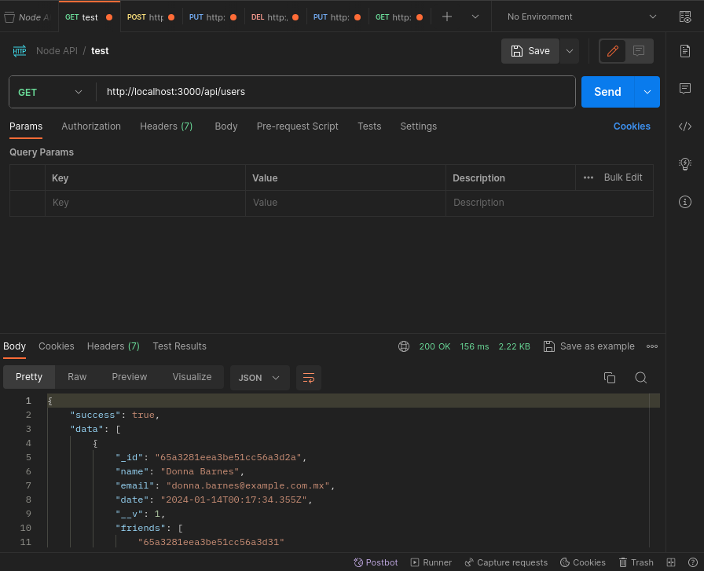
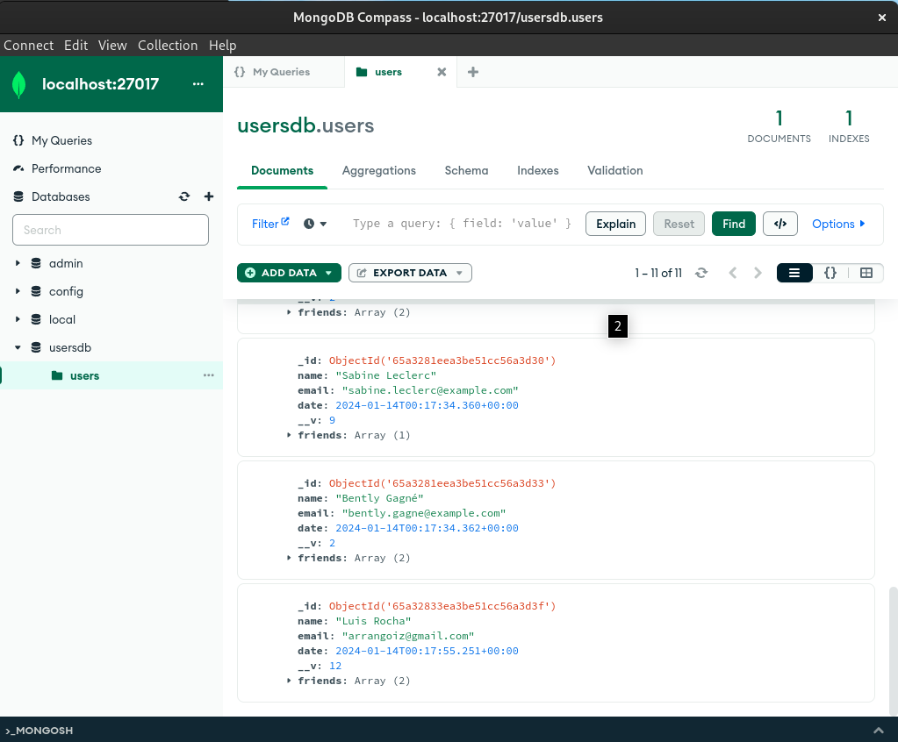

# Simple API for users management
### In this project you can test a simple API to perform CRUD operations on basic User's objects and manage friendships between them

## 1. Installation
- Run the containers using Docker Compose with the following command:
``` bash 
docker-compose up -d
``` 
- Wait until it finishes up downloading layers, building the images and starts running the containers.
## 2. Tech Stack
- This oroject uses ExpressJS to handle HTTP requests and MongoDB to persist data.
## 3. Usage
- I'd suggest using Postman or any available API platform tool to start playing with it.
- List of available endpoints:
  * GET users: /api/users
  * POST create a new user: /api/users
  * GET single user: /api/users/:id
  * PUT update user's information: /api/users/:id
  * DELETE remove a user: /api/users/:id
  * PUT Add a user's Friend relationship: /api/users/:id/friend
  * DELETE Remove a user's Friend relationship: /api/users/:id/friend
  * GET Get Relationship distance between two Users: /api/users/:id/degrees/:friendId
- If GET users endpoint is invoked for the first time, and there are no users in the DB, then it will autimatically SEED the DB with dummy data from randomusers.me public API.
- You can use MongoDB Compass to take a closer look to the Users collection, the connection string is: 
```mongodb://localhost:27017```
